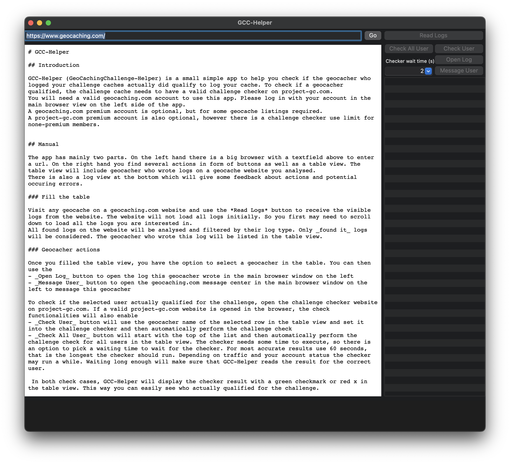

# GCC-Helper

For detail information please see [here](GCC-Helper/README.md)

## Download

You can download the latest release from this repository. Check the [release section](https://github.com/andre0707/GCC-Helper/releases).

## Supported Platforms

Currently GCC-Helper is a macOS only app.

## Images

Here is an image of the main view of the app

